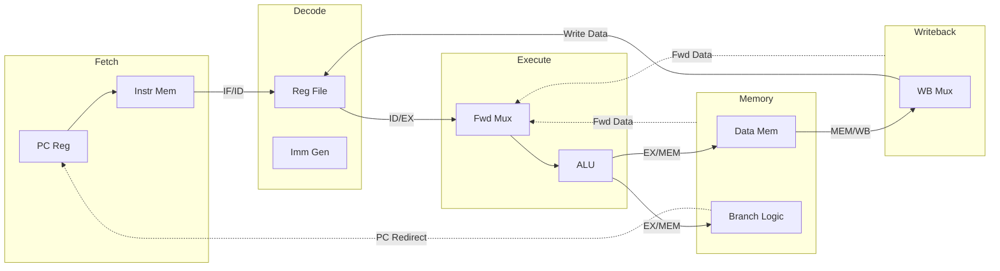
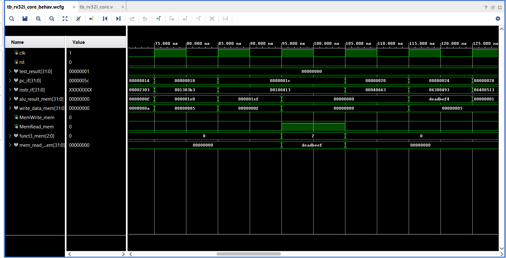
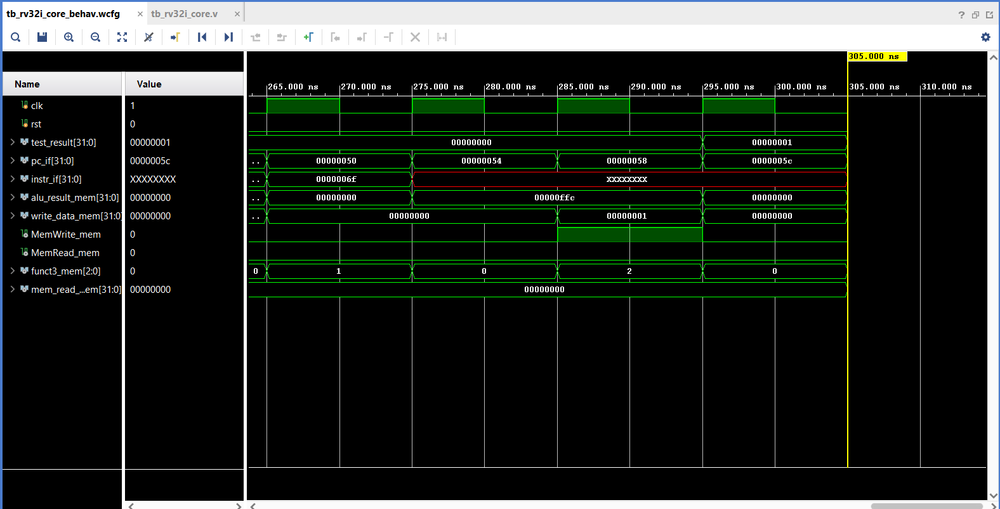

# RV32I 5-Stage Pipelined Processor

A Verilog-based 32-bit RISC-V processor targeting the **Xilinx Artix-7 FPGA**. This project implements a classic 5-stage pipeline with hardware hazard management and data forwarding.

---

## 📌 Project Highlights
* **Verilog-based 32-bit RISC-V processor implementation on FPGA using Xilinx Vivado with pipeline optimization and hardware verification.**
* **Built a 5-stage RV32I processor pipeline in Verilog using Xilinx Vivado, implementing complete data forwarding and hazard handling logic.**
* **Optimized ALU datapath architecture to reduce dynamic power to 28.0 mW by utilizing targeted operand isolation techniques throughout.**
* **Deferred branch logic to MEM stage for strict timing closure, achieving maximum clock frequency of 118.7 MHz with positive margins.**
* **Verified RTL functionality across comprehensive test suites, achieving compact implementation using 1086 LUTs and 605 FPGA registers.**

---

## 🏗️ Architecture & Pipeline Diagram

The core implements the **RV32I Base Integer Instruction Set** via a 5-stage pipeline: Instruction Fetch (IF), Instruction Decode (ID), Execute (EX), Memory (MEM), and Writeback (WB).



### Architectural Features
* **Data Forwarding (Bypassing)**: Routes data from the `MEM` or `WB` stages back to the `EX` stage, resolving RAW data hazards without stalling.
* **Load-Use Interlocking**: Hardware detects load-use dependencies and injects a 1-cycle stall bubble when necessary.
* **Deferred Branch Resolution**: Branch target calculation and condition evaluation (`beq`, `bne`, etc.) are placed in the `MEM` stage. This incurs a 3-cycle flush penalty on taken branches, but breaks the critical path associated with `EX`-stage branch resolution.
* **Operand Isolation**: ALU inputs are clamped to `0` via an `alu_en` signal during memory operations or stalls to reduce dynamic switching power.

---

## 📊 Synthesis & Performance Metrics
The design was synthesized Out-Of-Context (OOC) using **Vivado 2025.2** to evaluate the core logic footprint independently of external block RAM and I/O routing. Official Vivado `.rpt` files are available in the `reports/` directory.

| Metric | Result | Target Device |
| :--- | :--- | :--- |
| **Maximum Frequency** | 118.7 MHz (8.42 ns Path) | Xilinx Artix-7 (`xc7a100tcsg324-1`) |
| **Logic Utilization** | 1086 Slice LUTs | Artix-7 |
| **Register Utilization** | 605 Slice Registers | Artix-7 |
| **Dynamic Power** | 28.0 mW | Artix-7 |

---

## 🔬 Simulation Waveforms

The testbench output below demonstrates the core's ability to natively handle complex pipeline hazards and memory interactions.

### 1. Load-Use Hazard Interlocking
This trace shows a `lw` (Load Word) instruction executing. Notice how `MemRead_mem` pulses high, and the memory returns the sentinel value `deadbeef`. The Hazard Unit correctly detects that the following instruction depends on this load, stalling the Fetch and Decode stages to safely absorb the data.


### 2. Final Execution & Test Verification
At the end of the simulation, the CPU executes the final `sw` (Store Word) instruction. `MemWrite_mem` asserts high, writing the payload `00000001` to memory address `00000ffc`. On the very next cycle, the testbench confirms functional correctness by asserting `test_result = 00000001` (Test Passed).


---

## ⚠️ Scope & Known Limitations
This project focuses specifically on the base integer pipeline. It does **not** implement:
* **Exceptions or Interrupts**: No CSR (Control and Status Register) support.
* **M-Extension**: Hardware multiplication and division are not implemented.
* **C-Extension**: Compressed 16-bit instructions are not supported.
* **Compliance Testing**: While the core executes a custom assembly test suite correctly, it has not been run against the official RISC-V RV32I compliance test suite.

## 🔮 Future Work
* Integrate the official RISC-V compliance test framework to formally verify edge cases.
* Replace the behavioral memory models with an industry-standard AXI4-Lite memory interface.
* Implement CSRs and exception handling to support timer interrupts.
* Pipeline a hardware multiplier to support the RV32M extension.

---

## 📁 Repository Structure
```text
├── rv32i_core.v        # Main RTL containing the 5-stage pipeline and hazard units
├── tb_rv32i_core.v     # Testbench containing simulation checks and memory instantiation
├── imem.mem            # Hex payload for Instruction Memory (Assembly Test Suite)
├── dmem.mem            # Hex payload for Data Memory
├── constraints.xdc     # Timing constraints for Vivado Synthesis (118.7 MHz)
├── reports/            # Official Vivado synthesis reports (timing.rpt, util.rpt, power.rpt)
└── README.md           # Project documentation
```

## 🚀 How to Run & Simulate
1. Open Xilinx Vivado and create a new RTL Project targeting your FPGA.
2. Add `rv32i_core.v` as a Design Source.
3. Add `tb_rv32i_core.v`, `imem.mem`, and `dmem.mem` as Simulation Sources.
4. Add `constraints.xdc` to the Constraints.
5. Run Behavioral Simulation. The testbench verifies execution flow and prints completion status to the TCL console.
